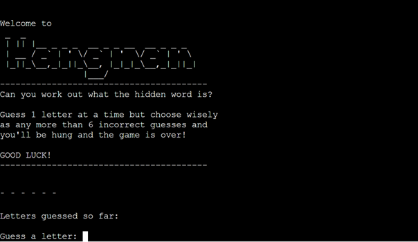
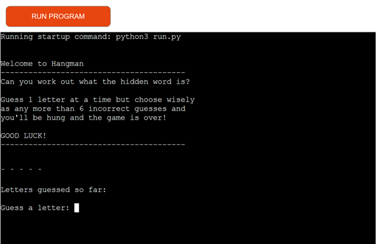
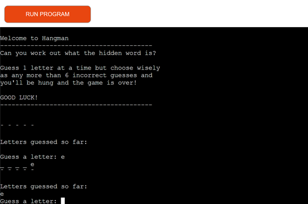
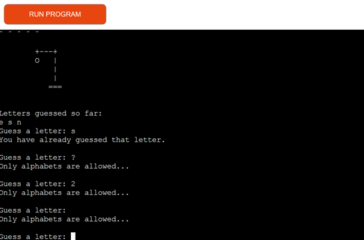
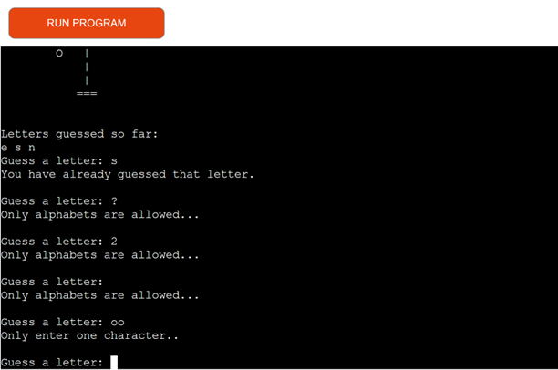
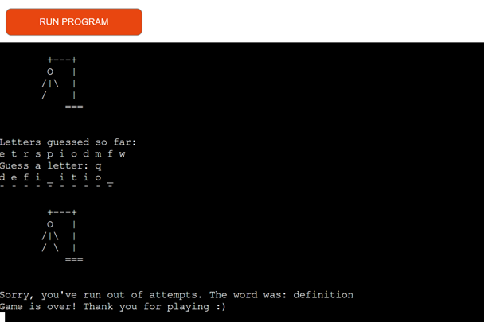
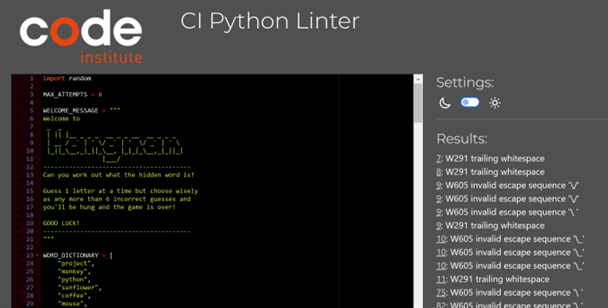
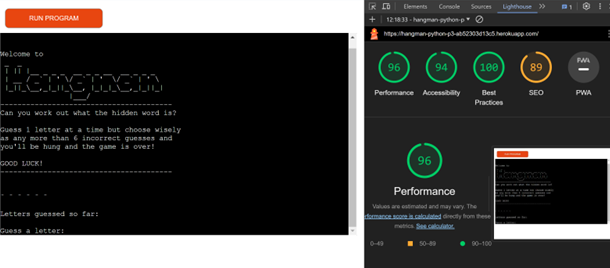

# Hangman - Game
(Developed by Jamie Hughes)

# Introduction
[Live Project Here](https://hangman-python-p3-ab52303d13c5.herokuapp.com/)
Project milestone 3 for Code Institute Full-stack development program: Python Terminal.
<brZ>
Hangman is a Python terminal game, which runs in the Code Institute mock terminal on Heroku. The main goal of the game is to guess letters in order to find the word that the computer randomly selects. This project was inspired by the pencil guessing game for two or more players. 

## README Table Content

* [Introduction](#introduction)
* [User Experience](#user-experience)
* [Design](#design)
* [Features](#features)
* [Game Features](#game-features)
    * [Hangman Start Up](#hangman-start-up) 
    * [Correct Guess](#correct-guess)
    * [ Incorrect Guess](#incorrect-guess)
    * [Guessing the same letter](#guessing-the-same-letter)
    * [Only alphabets are allowed](#only-alphabets-are-allowed) 
    * [Winning](#winning)
    * [Losing](#losing)
* [Technologies Used](#technologies-used)
    * [Languages Used](#languages-used)
    * [Programs Used](#programs-used)
* [Testing](#testing)
    * [CI PEP 8 Replacement](#ci-pep8-replacement)
    * [Lighthouse](#lighthouse)
    * [Functionality](#Functionality)
    * [Problems and Bugs](#problems-and-bugs)
* [Deploying this Project](#deployment-this-project)
    * [Forking this Project](#forking-this-project)
    * [Cloning this Project](#cloning-this-project)
* [Credits](#credits)
* [Content](#content)

## User Experience
### User Stories

* As a website creator, I want to:
  
1. Build an easy app for the users to play the game without any issues arising.
2. Build a game that is both enjoyable and challenging for the players.
   
* As a new visitor, I want to:

1. Be able to understand the purpose of the App.
2. Be able to see the correct and incorrect letters appear once I take a turn, and see how many tries remain before the game is over.
3. Have fun with an easy to follow online game.
   
* As a returning visitor, I want to:

1. Be able to play the game again with a different word as chosen by the computer.
   
## Design

I wanted the user to experience simplistic and original design of the classic hangman game by keeping it as simple as possible. Using minimal keyboard symbols such as +, -, = and |. This was easily achieved. 

## Features

### Welcome Message and Game Rules
The user is welcomed to the game with a simple message and clear explanation of how to play the game and how to start. The user then guesses any letter to start the game. 

## Game Features

### Hangman Start Up

When the game begins to run, the user is receives an instant welcome message followed by a description of how to play the game.

The user has the following information in preparation to start the game:
* Numbers of letters chosen by the computer 
* Hangman stages (6 incorrect guess chances)
* Letters guessed so far (which at this stage is currently 'none'
* The option to guess their first letter

In the pictured example you can see the user has to guess a 5 letter.

### Correct Guess

Once the user has guessed a single letter from the alphabet, they would have either guess correctly or incorrectly. From this picture you can see the user guess 'e' correctly and it is the last letter of the 5 letter word.

### Incorrect Guess

If the user guesses an incorrect letter, as pictured, the user will see the first of 6 hangman stages displayed in the portal. This is the first picture that shows the updated 'Letters guessed so far' box so the user knows not to guess those letters again.

### Guessing the same letter

If the user attempts the guess a letter which has already been entered, they will receive a message notifying them that 'You have already guessed that letter', and the user can then guess another letter. This does not effect the number of correct or incorrect guesses.

### Only alphabets are allowed

The user can only enter letters in the english alphabet, if the user was to enter a number, special character or even an empty space then the user would receive a message 'Only alphabets are allowed'. 
Similarly, as the user can only guess one letter at a time, if the user guesses multiple letters the user would receive a message 'Only enter one character'. Neither of these effect the number of correct or incorrect guesses.

### Winning
If the user guesses all the letters of the word before entering 6 incorrect guesses the user wins and is congratulated with the following message 'Congratulations! You've guessed the word:' followed by the word they guessed correctly.

### Losing

With each incorrect guess the user will see the development of the hangman stages. If the user accumulates 6 incorrect guesses, they will see the entire hangman display, the game is over and will receive a message 'Sorry, you've run out of attempts, the word was:' followed by the correct word and the game is over.

## Technologies Used
### Languages Used 

* [Python](https://www.python.org/)
  
### Programs Used

* [GitHub](https://github.com/)
    * GitHub is used to store the project's code after being pushed from Git
* [Heroku](https://id.heroku.com)
    * Heroku was used to deploy the live project
 * [Patorjk](https://patorjk.com)
    * Patorjk (ASCII Art Generator) was used to draw the game logos
* [CI PEP8 Replacement](https://pep8ci.herokuapp.com/)
	* Was used to validate all the Python code

## Testing

### CI PEP8 Replacement

Since the demise of pep8online, Code Institute recommended using https://pep8ci.herokuapp.com/) 

Features of this include:  

-   Paste or type in Python code to have it instantly PEP8 linted
-   Click on the line number in the PEP8 error to go directly to the line
-   Dark or light mode

Once I had printed my code, the only results picked up where 'trailing whitespace' within the logo and 'invalid escape sequence' within the hangman stages to create an image.
  
### Lighthouse

 Lighthouse was used to test performance,  accessibility, best practices, and SEO on the Desktop.

* Desktop Results:

## Functionality 
* The terminal has no issues and is working properly 
* The typewriter starts typing at the right time and is working correctly 

## Problems and Bugs
### Destroyed Workspace
* During this project, I went abroad on holiday for 2 weeks so this project was untouched for about 3 weeks. I was under the impression I had pinned the relevant workspace for this project, however once I returned, I received this message "Unused workspaces will be destroyed 2 weeks after they were last stopped. Pinned workspaces are never destroyed." and the workspace had been destroyed.
<brZ>
I contacted student care and tutor assistance to rectify this issue and create a new workspace but was advised to include this in this README.md file as some of the commit message may not be there due to pasting my code into my new workspace. 

### Python Lines too Long
* Throughout the project, a common bug was displaying as 'lines too long'. This for the most part, this proved to be an easy fix, by shortening the code or simply printed the remainder of the code onto the next line.
 
## Deploying this Project

* This site was deployed by completing the following steps:

1. Log in to [Heroku](https://id.heroku.com) or create an account
2. On the main page click the button labelled New in the top right corner and from the drop-down menu select Create New App
3. You must enter a unique app name
4. Next select your region
5. Click on the Create App button
6. The next page is the project’s Deploy Tab. Click on the Settings Tab and scroll down to Config Vars
7. Click Reveal Config Vars and enter port into the Key box and 8000 into the Value box and click the Add button
8. Click Reveal Config Vars again and enter CREDS into the Key box and the Google credentials into the Value box
9. Next, scroll down to the Buildpack section click Add Buildpack select python and click Save Changes
10. Repeat step 8 to add node.js. o Note: The Buildpacks must be in the correct order. If not click and drag them to move into the correct order
11. Scroll to the top of the page and choose the Deploy tab
12. Select Github as the deployment method
13. Confirm you want to connect to GitHub
14. Search for the repository name and click the connect button
15. Scroll to the bottom of the deploy page and select the preferred deployment type
16. Click either Enable Automatic Deploys for automatic deployment when you push updates to Github

## Forking This Project

* Fork this project by following the steps:

1. Open [GitHub](https://github.com/)
2. Click on the project to be forked
3. Find the Fork button at the top right of the page
4. Once you click the button the fork will be in your repository

## Cloning This Project

* Clone this project by following the steps:
  
1. Open [GitHub](https://github.com/)
2. Click on the project to be cloned
3. You will be provided with three options to choose from, HTTPS, SSH, or GitHub CLI, click the clipboard icon in order to copy the URL
4. Once you click the button the fork will be in your repository
5. Open a new terminal
6. Change the current working directory to the location that you want the cloned directory
7. Type git clone and paste the URL copied in step 3
8. Press Enter and the project is cloned

## Credits

### Content

* All the content in the game is original 
* The terminal function and template for the deployable application was provided by [Code Institute - Template](https://github.com/Code-Institute-Org/python-essentials-template)
  
### Information Sources / Resources

* [W3Schools - Python](https://www.w3schools.com/python/)
* [Scrimba - Pyhton](https://scrimba.com/learn/python)
* [Gambiter](http://gambiter.com/paper-pencil/Hangman_game.html)

## Special Thanks

  * Special thanks to my mentor Sandeep Aggarwal, my colleagues at Code Institute for their assistance throughout this project.